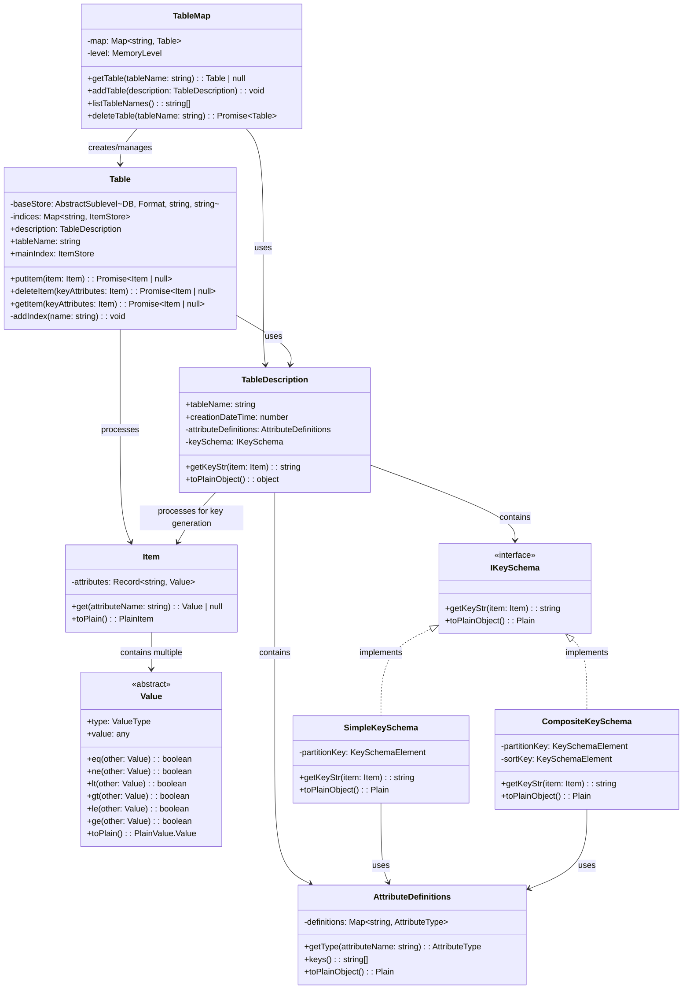

# Class Diagram for TableMap and Dependencies

This document shows the class diagram for the `TableMap` class and its dependencies.

## Overview

The `TableMap` class manages DynamoDB tables in memory, with each table containing items that follow a specific schema defined by `TableDescription`.

## Class Diagram

**Note**: External library classes (MemoryLevel, AbstractLevel, AbstractSublevel, Big) are not shown in the diagram for clarity. Only classes defined within this codebase are included.

## Key Classes and Their Responsibilities

### Core Classes

- **TableMap** (`lib/db/TableMap.ts:7`): Main entry point for table management. Maintains a map of tables and provides CRUD operations for table lifecycle.

- **Table** (`lib/db/TableMap.ts:40`): Represents a single DynamoDB table with its storage backend and indices. Handles item operations (put/get/delete).

- **TableDescription** (`lib/domain/TableDescription/index.ts:22`): Contains table metadata including name, attribute definitions, and key schema. Provides key string generation for items.

### Data Types

- **Item** (`lib/domain/Item.ts:5`): Represents a single item in a table. Contains attributes as key-value pairs where values are typed DynamoDB values.

- **Value** (`lib/domain/Value.ts:111`): Abstract base class for DynamoDB attribute values. Provides comparison operations and serialization.

- **SValue/NValue/BValue** (`lib/domain/Value.ts:151`, `lib/domain/Value.ts:182`, `lib/domain/Value.ts:284`): Concrete implementations for String, Number, and Binary values respectively. Key values can generate hash and sortable strings.

### Schema Management

- **AttributeDefinitions** (`lib/domain/TableDescription/AttributeDefinitions.ts:15`): Manages table attribute definitions, ensuring uniqueness and providing type lookups.

- **IKeySchema/SimpleKeySchema/CompositeKeySchema** (`lib/domain/TableDescription/KeySchema.ts:37`, `lib/domain/TableDescription/KeySchema.ts:59`, `lib/domain/TableDescription/KeySchema.ts:97`): Handle table key structure for both simple (partition key only) and composite (partition + sort key) tables.

## Dependencies

### External Libraries
- **MemoryLevel**: In-memory storage backend from the `memory-level` package
- **AbstractLevel/AbstractSublevel**: Type definitions from the `abstract-level` package
- **Big**: Arbitrary precision decimal arithmetic from the `big.js` package

### Error Handling
- **validationException** (`lib/domain/errors.ts:1`): Thrown for validation errors
- **resourceInUseException** (`lib/domain/errors.ts:7`): Thrown when attempting to create a table that already exists